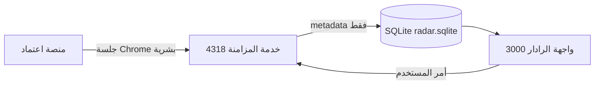
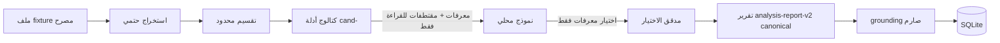

# ARCHITECTURE — معمارية رادار المنافسات

> وصف محايد للحالة الحالية. لا يُعتبر أي وكيل برمجي أو نموذج ذكاء اصطناعي جزءًا ثابتًا
> من المعمارية — كلاهما قابل للاستبدال دون تغيير العقود.

## المكونات

- **واجهة الرادار المحلية** (`app/`، تعمل على `http://localhost:3000` عبر `npm run dev`
  أو المشغّل المعتمد): قراءة وعرض فقط من SQLite، مع إجراءات المستخدم (مزامنة، تحليل، موافقات).
- **خدمة المزامنة المحلية** (`scripts/etimad-sync-service.mjs`، منفذ 4318): HTTP محلي بحت،
  تنفذ خطط المزامنة، وتكشف صحتها على `/health` وتدير مهام التحليل عبر `/analysis/*`.
- **جلسة Chrome البشرية** (`scripts/lib/radar-chrome-session.mjs`): بروفايل مستقل للمالك؛
  تسجيل الدخول وCAPTCHA بشريان دائمًا، والقارئ لا يتصل قبل اكتمال الدخول.
- **SQLite كمصدر موحد** (`.radar-data/radar.sqlite`، schemaVersion 7): كل الحالة التشغيلية —
  المنافسات، التفاصيل، الموافقات، مهام التحليل، الأدلة، سجلات النموذج.
- **n8n كمنسق محلي** (`workflows/`): تنسيق لاحق للخطوات المحلية؛ لم يُختبر end-to-end بعد (P4‑N0).
- **Ollama كمزود تحليل محلي** (`scripts/lib/analysis-providers.mjs`): loopback فقط، معطل
  افتراضيًا، بلا سحب نماذج، والنموذج من `OLLAMA_MODEL`. المزود الافتراضي العامل `stub` حتمي.
- **fixtures وقواعد الاختبار** (`analysis-fixtures/`، `tests/helpers/`): مستندات اصطناعية
  PDF/XLSX/DOCX وقواعد SQLite مؤقتة في مجلد temp — الاختبارات لا تلمس قاعدة التشغيل.
- **بوابات الموافقة البشرية** (`scripts/lib/download-gate.mjs` و`attachment-adapters.mjs`):
  نوايا موافقة محكومة بمرجع منافسة وملف وبصمة؛ لا استهلاك إلا عند تنفيذ حي مصرح.

## تدفق البيانات: من اعتماد إلى الرادار

1. الإنسان يسجل الدخول في نافذة Chrome البشرية (الرادار لا يحفظ كلمة المرور).
2. خدمة المزامنة تقرأ صفحات القوائم (حتى 100 نتيجة/منطقة، قيمة كراسة 0–600 ريال)
   وتخزن **metadata** القائمة مع نقاط استئناف.
3. تفاصيل المنافسة تُلتقط من صفحة التفاصيل — وهي المصدر الموثوق لقيمة الكراسة.
4. أسماء المرفقات metadata فقط؛ **أي binary file يتطلب بوابة الموافقة** ولم يُنزَّل أي ملف.

## تدفق المستند: من ملف مصرح به إلى تقرير

1. الاستخراج (`analysis-documents.mjs`) نصي حتمي بفحص امتداد وتوقيع وحدود ZIP/PDF.
2. التقسيم (`analysis-chunking.mjs`) بحد صارم لكل جزء.
3. الكتالوج (`analysis-evidence-candidates.mjs`) يستخرج مقتطفات حرفية بمعرفات `cand-`
   حتمية (SHA‑256)، بحدود 48 مرشحًا / 6000 حرف / 400 حرف للمقتطف.
4. النموذج يستلم مخطط `analysis-model-selection-v2` الديناميكي و**يختار معرفات فقط** —
   لا يكتب excerpt ولا evidence ولا statement ولا summary ولا warnings.
5. `materializeCanonicalReport` يبني التقرير من الكتالوج المحلي، ثم التحقق الكلي،
   ثم تطبيع المعرفات بنطاق المهمة، ثم `verifyReportGrounding` بلا تخفيف.
6. الفشل في أي حاجز ⇒ المهمة `failed` بكود خطأ واضح، بلا تقرير ولا إعادة محاولة.

## metadata مقابل binary file

- **metadata**: كل ما يقرأ من الصفحات ويُخزن في SQLite (عناوين، مراجع، قيمة الكراسة،
  أسماء المرفقات، حالات). قابل لإعادة الجلب والتصحيح.
- **binary file**: محتوى ملف فعلي. لا يوجد حاليًا أي مسار مفعّل لجلبه؛ المحوّل المحكوم
  معطل افتراضيًا ويخضع لحجر (quarantine) وفحص توقيع وSHA‑256 قبل أي نقل — انظر
  SAFETY_BOUNDARIES.md.

## قابلية الاستبدال

الواجهة، الخدمة، المستودع، المزود، والنموذج تتصل عبر عقود داخلية موثقة بالاختبارات.
يجوز استبدال أي منفذ أو مشرف أو نموذج محلي بآخر مكافئ ما دامت العقود والحدود محفوظة؛
ولا يجوز لأي وكيل تغيير عقدة دون مهمة مكتوبة ومراجعة مستقلة.
